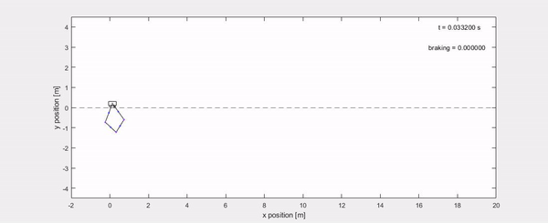
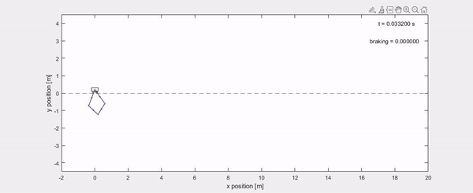

#  Modelling and Simulation MiniProject
First simulation with  up until 5 seconds, and 
 for the final 5 seconds. The brakes are turned on at 5 seconds
  
  

Second simulation, . No braking. , ,   

  
Simulation 3 with  for t < 5,  for t > 5, and braking when t > 5  

  
Simulation 4, showing how the sensor alarm reacts to the angular velocities.  for . Brakes are activated after 7.5 seconds.  

  

The full lagrangian expression, and the formulas to obtain all equations of motion can be found in SymbolLagrange.mlx
